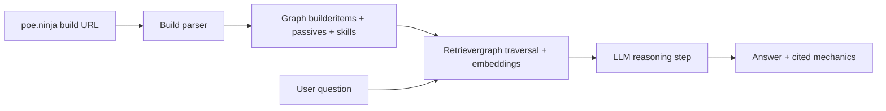

# BuildSense — a structured-retrieval RAG over interconnected game mechanics

Most RAG systems retrieve flat text. This one operates over a domain where the
"right answer" requires traversing entity relationships: an item modifies a
passive node, which scales a skill, which determines damage type, which 
interacts with a defensive layer. Naive semantic similarity returns plausible
but mechanically wrong answers.

BuildSense ingests a Path of Exile 2 character build (sourced from poe.ninja)
and answers questions like "where does my damage come from?" or "what are my
defensive layers?" by combining graph-aware retrieval with an LLM reasoning
step. The system is designed around an evaluation harness that catches
mechanically incorrect answers — the failure mode that naive RAG systems hide.

## Why this is interesting (engineering perspective)

- Domain data is graph-shaped, not text-shaped — embedding-only retrieval fails
- Build correctness is verifiable, so eval ground truth is achievable
- Latency and cost matter (player tool, not batch job) — observability built in

- ## Architecture (v0)

## How will I verify the correctness of this program?

I will prepare 5 builds covering different cases:
- 1 melee phys, 1 spell, 1 minion, 1 hybrid (e.g. converted damage), 1 niche/edge case
Why these? They exercise different mechanic graph paths — pure damage scaling
vs. conversion chains vs. minion stat inheritance.

For each build, I will write 10 questions with verified correct answers, 
covering: damage sources, defensive layers, scaling mechanics, and edge cases.
Total: 50 test cases.

A response counts as:
- PASS: identifies the correct mechanic and the correct source
- PARTIAL: identifies the mechanic but misses the source (or vice versa)
- FAIL: incorrect or hallucinated

Pass rate target for v1: 70% PASS, <10% FAIL.

## What will I measure while the program is running?

Per request:
- Latency: p50 and p95 (target: p95 < 5s)
- Cost: USD per query, broken down by embedding vs LLM tokens
- Retrieval hit rate: did the retriever return the relevant graph nodes?
- Answer accuracy: PASS/PARTIAL/FAIL (from eval harness)

Aggregated:
- Cost per 100 queries
- Eval pass rate over time as I iterat
- 
## What documents will I test it on?

Top 5 most popular builds from poe.ninja for the current league, selected
to cover different ascendancies and damage types. Stored locally as 
fixtures so eval results are reproducible across runs.

## Design decisions

Choosing graph traversal instead of pure embeddings is the more appropriate approach for this domain. Path of Exile 2 is known for complex character builds and a large number of complicated mechanics, prefixes, and suffixes. Examples of such dependencies include: more damage, increased damage, damage converted to, and minion damage. As we can see, they all sound similar, but their actual effects are completely different. That is why embeddings alone would not be enough. The keyword “damage” by itself does not tell us much, while adding graph traversal allows us to check relationships, which is much more precise.
I chose poe.ninja because it is the most popular website for browsing builds. The problem is that the website currently does not have an API, so a web scraper will be needed. This is not the best solution because it may require updates in the future, but unfortunately, at the moment, we do not have another option.

If I had spent six more months on development, I would have considered: 
a) Data collection — poe.ninja is a good temporary solution, but a better option would be to allow builds to be imported into our domain, or to use data from the game files. This would reduce the costs of maintaining and using the web scraper, and access to the data would also be easier. 
b) Caching common builds and answers — many builds share common characteristics, for example builds based on fire damage or minions. In addition, most questions are asked about the most popular builds used by content creators. A good solution would be to store data for the most popular builds, together with questions and answers related to them. This would reduce costs, because querying a database is much cheaper than asking an LLM. 

Each session logs question, answer, and user rating. Weekly review of negative-rated answers expands the eval set with real user questions and corrected ground truths.
