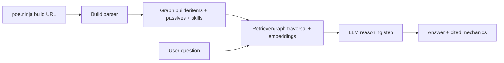

# BuildSense — a structured-retrieval RAG over interconnected game mechanics

Most RAG systems retrieve flat text. This one operates over a domain where the
"right answer" requires traversing entity relationships: an item modifies a
passive node, which scales a skill, which determines damage type, which 
interacts with a defensive layer. Naive semantic similarity returns plausible
but mechanically wrong answers.

BuildSense ingests a Path of Exile 2 character build (sourced from poe.ninja)
and answers questions like "where does my damage come from?" or "what are my
defensive layers?" by combining graph-aware retrieval with an LLM reasoning
step. The system is designed around an evaluation harness that catches
mechanically incorrect answers — the failure mode that naive RAG systems hide.

## Why this is interesting (engineering perspective)

- Domain data is graph-shaped, not text-shaped — embedding-only retrieval fails
- Build correctness is verifiable, so eval ground truth is achievable
- Latency and cost matter (player tool, not batch job) — observability built in

- ## Architecture (v0)

## How will I verify the correctness of this program?

I will prepare 5 builds, each with 10 questions and the correct answers. Then I will check whether the program correctly analyzed a given build and whether it is able to provide the correct answer.

## What will I measure while the program is running?

Cost, time, answer accuracy, and the complexity of the problem to be solved.

## What documents will I test it on?

I will test it on builds from PoE Ninja that are web-scraped by this program.
