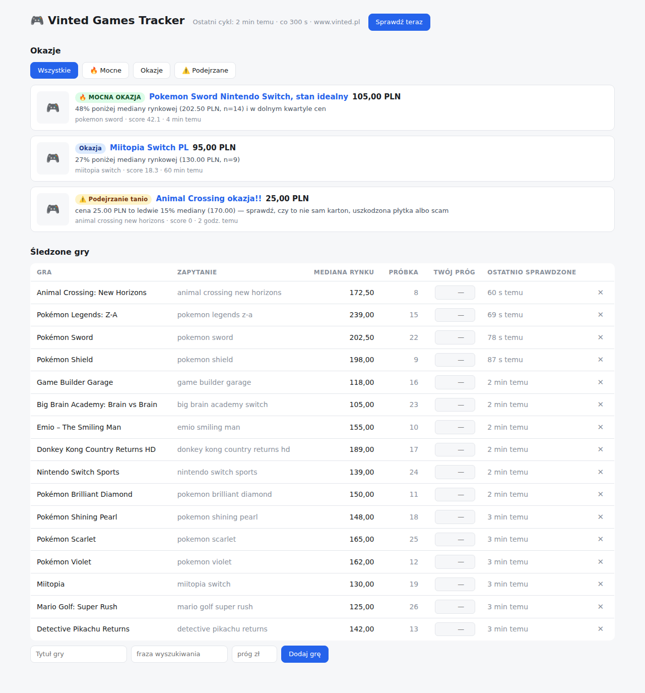

# Vinted Games Tracker (C#)

Śledzi nowo dodawane oferty gier na Vinted, ocenia je i pokazuje okazje
w webowym dashboardzie. C#/.NET 8, aplikacja bez zewnętrznych zależności
NuGet (tylko testy używają xunit).



## Jak to działa

1. Pętla w tle co `pollIntervalSeconds` odpytuje nieoficjalne API katalogu
   Vinted (`/api/v2/catalog/items`, to samo, z którego korzysta strona) dla
   każdej gry z watchlisty (`games.json`), sortując od najnowszych. Klient
   sam pobiera anonimowe ciasteczka sesji i odświeża je przy 401/403.
2. Nowe oferty (niewidziane wcześniej ID) zapisuje w pliku stanu JSON.
3. Każdą nową ofertę klasyfikuje (patrz „Definicja mocnej okazji” niżej).
4. **Mocne okazje** wysyła push-em (Discord/Telegram, jeśli skonfigurowane);
   wszystkie okazje i oferty podejrzane lądują w dashboardzie.

Pierwszy przebieg tylko zapełnia stan (bez alertów), żeby nie zalać Cię
wszystkim, co już wisi w katalogu.

## Definicja mocnej okazji

Pojedynczy sygnał cenowy kłamie, więc ocena jest wielowarstwowa:

1. **Filtr trafności.** Wyniki wyszukiwania są pełne akcesoriów — etui,
   steelbooki, amiibo, poradniki, *same kartony* — które są tanie, bo nie są
   grą. Odrzucamy je po słowach kluczowych, zanim policzymy cokolwiek
   (lista w `DealEvaluator.AccessoryKeywords`).
2. **Odporna cena odniesienia.** Mediana z próbki przyciętej o 10% z każdej
   strony (odporna na bundle za 400 zł i wraki za 20 zł), liczona dopiero od
   5 ofert. Próbka = bieżące wyniki + historia z ostatnich 30 dni.
3. **Mocna okazja wymaga dwóch niezależnych sygnałów:**
   - cena ≤ **60% mediany** *i jednocześnie* w **dolnym kwartylu** próbki, albo
   - cena z wyraźnym zapasem (≤ **85%**) poniżej Twojego ręcznego progu
     `maxPrice` dla tej gry.
4. **Zwykła okazja:** cena ≤ 75% mediany albo ≤ `maxPrice`.
5. **Bezpiecznik too-good-to-be-true.** Cena ≤ **30% mediany** to częściej
   scam, uszkodzona płytka albo „samo pudełko” niż okazja — taka oferta
   dostaje status *Podejrzanie tanio* zamiast alertu.

Wynik (score) okazji to procent rabatu względem najlepszego odniesienia —
służy do sortowania alertów.

Progi (`StrongRatio`, `DealRatio`, `SuspiciousRatio`, …) są stałymi
w `DealEvaluator` — łatwo je przestroić.

## Wymagania

- [.NET SDK 8.0](https://dotnet.microsoft.com/download/dotnet/8.0)

## Uruchomienie

```bash
cd vinted-tracker-csharp
dotnet run --project src/VintedTracker
# Dashboard: http://localhost:5177
```

Konfiguracja jest opcjonalna — bez `config.json` działają wartości domyślne
(rynek `vinted.pl`, cykl co 5 min, port 5177). Żeby coś zmienić:
`cp config.example.json config.json` i edytuj.

Tryb jednorazowy bez UI (np. pod crona): `dotnet run --project src/VintedTracker -- --once`.

Powiadomienia push (opcjonalne) konfigurują zmienne środowiskowe:

```bash
export DISCORD_WEBHOOK_URL="https://discord.com/api/webhooks/..."
export TELEGRAM_BOT_TOKEN="123456:ABC..."
export TELEGRAM_CHAT_ID="123456789"
```

## Dashboard

- **Okazje** — kanał z kartami (🔥 mocna / okazja / ⚠️ podejrzanie tanio),
  filtrowanie po typie, link do oferty, powody klasyfikacji, score.
- **Śledzone gry** — mediana rynkowa i wielkość próbki na żywo, edycja
  progu `maxPrice` wprost w tabeli, dodawanie i usuwanie gier, błędy
  pobierania per gra.
- **Sprawdź teraz** — ręczne wywołanie cyklu poza harmonogramem.

Watchlista mieszka w `games.json` (edytowalna też ręcznie); w repo jest
wypełniona grami Nintendo Switch.

## Testy

```bash
dotnet test
```

## Zastrzeżenia

- To **nieoficjalne** API — Vinted może je zmienić lub ograniczać zbyt częste
  zapytania. Tracker odświeża anonimową sesję przy 401/403 i losowo rozciąga
  odstępy, ale używaj rozsądnych interwałów i tylko do użytku osobistego.
- Mediana rynkowa jest tym lepsza, im dłużej tracker działa i im
  precyzyjniejsze jest zapytanie (np. `"mario kart 8 deluxe switch"` zamiast
  `"mario"`).
- Dashboard nie ma logowania — słuchaj na `localhost` (domyślnie) albo
  zabezpiecz go samodzielnie, zanim wystawisz na zewnątrz.
